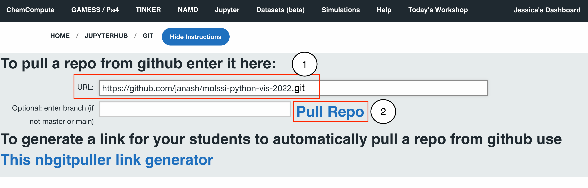

## MolSSI Python Visualization - Setting up chemcompute

1. **Create a chemcompute accout** For this workshop, we recommend using the Jupyter notebook on [chemcompute.org](https://chemcompute.org/). Navigage to chemcompute.org and create an account using an academic email address. After you create your account, you will recieve an email to verify your account. After you have verified your account, go to the next step to download files for the workshop.

1. Go to chemcompute.org and select "Jupyter" in the top menu. Then click "Clone a github repo to your notebook" 

2. On the next page enter `https://github.com/janash/molssi-python-vis-2022.git` and click "Pull Repo"

This should download the starting files for the workshop to chemcompute. You are now ready for the workshop!
